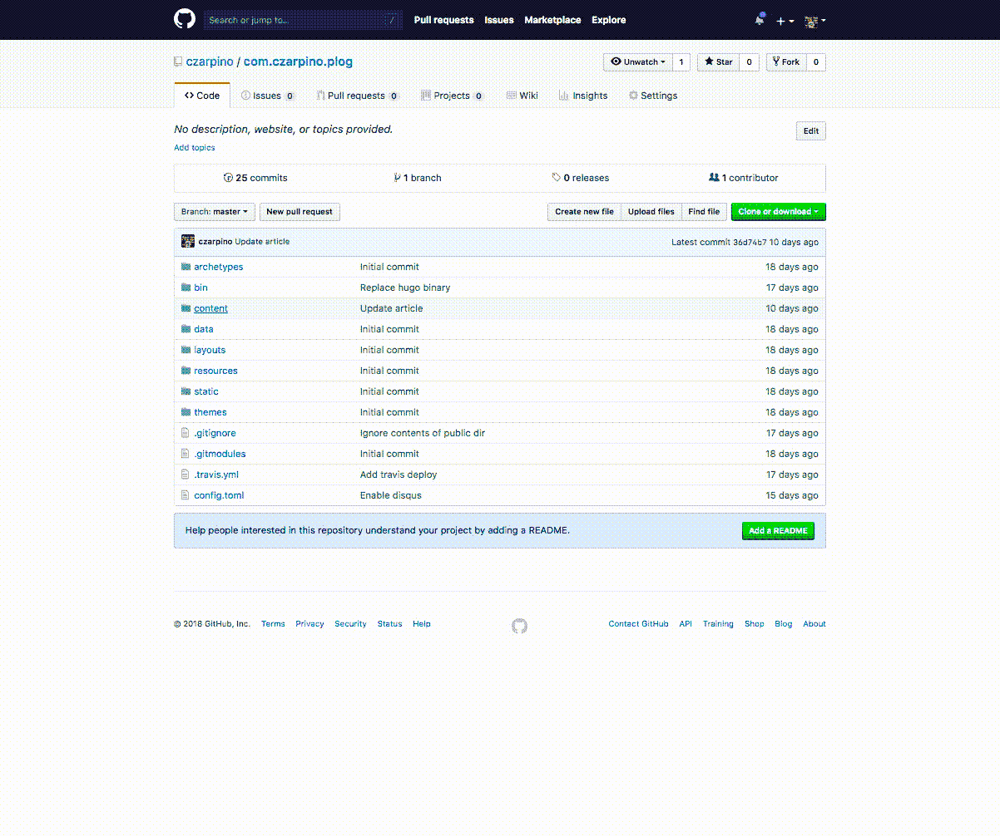

Sometimes you need to illustrate a use case which includes a series of actions. This can be a bit awkward to capture using a series of screenshots. A useful solution I've found is to use animated GIFs. Rather than an unwieldy screencast which can't be embedded in merge requests, I use GIFs.



Now, I've only done this for macOS.

1. Using the Chrome extension [Nimbus Screenshot](https://chrome.google.com/webstore/detail/nimbus-screenshot-screen/bpconcjcammlapcogcnnelfmaeghhagj?hl=en), record a video of your current tab (or screen).
2. Once done, you should be able to download a `.webm` video file of your recording.
3. To convert the `.webm` file to GIF, use `ffmpeg` (to install, `brew install ffmpeg`)
4. Once installed, generate the GIF using the command

    ```bash
    ffmpeg -i /Path/to/video.webm output.gif
    ```
5. Tadaa! You now have a GIF screencast!

### Reducing file size

GIF file size is typically larger than the video version. You will have to either optimize the image further to reduce file size or, if possible, reduce the screencast duration.

To optimize the image, you can:

- Reduce frame rate
- Use [gifsicle](https://github.com/kohler/gifsicle)

#### Reducing frame rate

For page screencasts with very few moving elements, the video should still be understandable even with greatly reduced frame rate. The following reduces frame rate to 10. 

```bash
fmpeg -i /Path/to/video.webm -r 10 output.gif
```

#### Using gifsicle

> Gifsicle manipulates GIF image files. Depending on command line options, it can merge several GIFs into a GIF animation; explode an animation into its component frames; change individual frames in an animation; turn interlacing on and off; add transparency; add delays, disposals, and looping to animations; add and remove comments; flip and rotate; optimize animations for space; change images' colormaps; and other things

While primarily for GIF image manipulation, gifsicle can also be used to optimize GIF file size. To install with homebrew, simply run `brew install gifsicle`. Then to optimize a GIF image:

```bash
gifsicle -O3 -i output.gif -o output-optimized.gif
```

### Benchmark

```yaml
file: img/screencast.gif
webm: 1.0M
ffmpeg: 1.4M
ffmpeg(-r10): 924K
gifsicle: 876K
gifsicle(--no-background/-k16): 656K
```

### Related article

- http://hanxue-it.blogspot.com/2017/10/how-to-convert-webm-to-gif-and-reduce.html